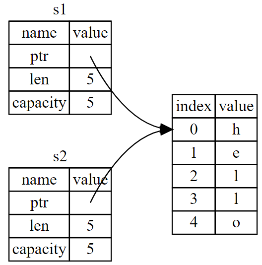
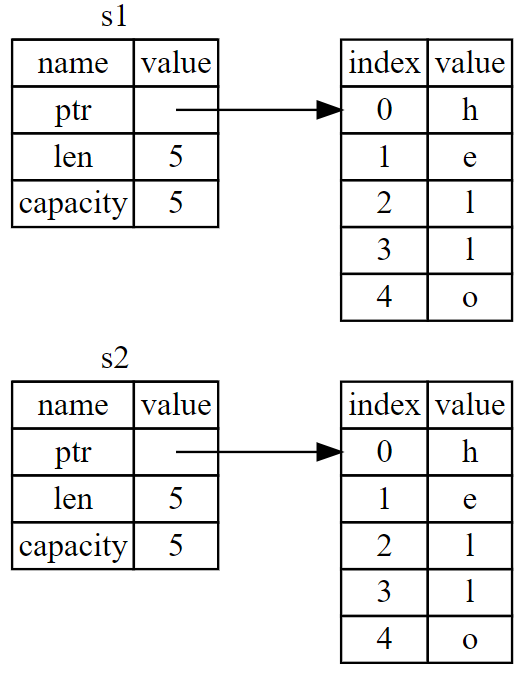
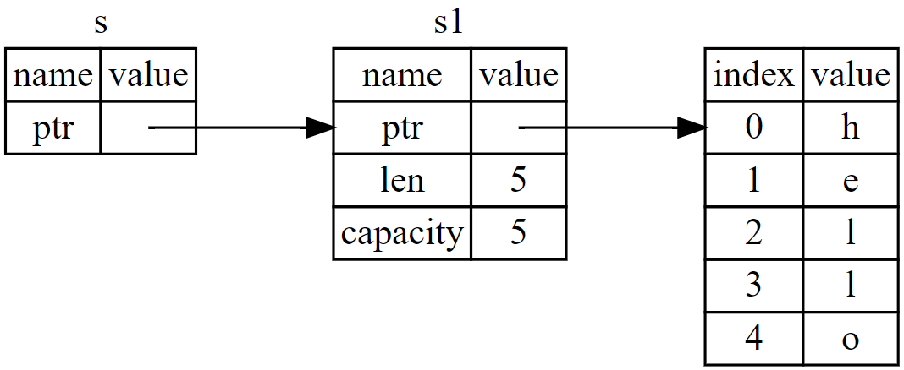
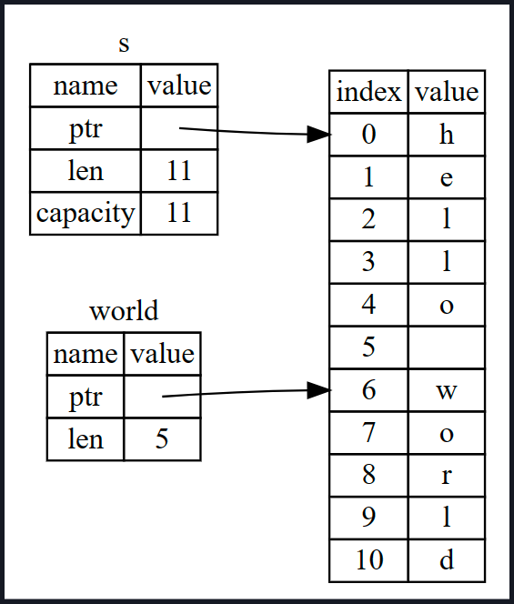

# 所有权（ownership）

一些语言（Python）具有垃圾回收机制，在程序运行时有规律地寻找不再使用的内存；在另一些语言中（C++），程序员必须亲自分配和释放内存。**Rust 通过所有权系统管理内存**，编译器在编译时会根据一系列的规则进行检查。如果违反了任何这些规则，程序都不能编译。在运行时，所有权系统的任何功能都不会减慢程序。其所有权规则如下：

1. Rust 中的每一个值都有一个所有者（owner）；
2. 值在任一时刻有且只有一个所有者；
3. 当所有者（变量）离开作用域，这个值将被丢弃。

## 1. 什么是所有权

### 1.1 变量的作用域

```rust
{                      // s 在这里无效，它尚未声明
    let s = "hello";   // 从此处起，s 是有效的
    // 使用 s
}                      // 此作用域已结束，s 不再有效
```

### 1.2 String 类型

Rust 的 `String` 类型管理被分配到堆上的数据，能够存储在编译时未知大小的文本。可以使用 `from` 函数基于字符串字面值来创建 `String`，如下：

```rust
let s = String::from("hello");
s.push_str(", world!"); // push_str() 在字符串后追加字面值

println!("{}", s); // 将打印 `hello, world!`
```

### 1.3 内存分配

`String` 类型是不可变的，为了支持一个可变，可增长的文本片段，需要在堆上分配一块在编译时未知大小的内存来存放内容。即：

- 必须在运行时向内存分配器（memory allocator）请求内存；
- 需要一个当我们处理完 `String` 时将内存返回给分配器的方法。

对于第一部分：当调用 `String::from` 时，它的实现 (*implementation*) 请求其所需的内存，第二部分：Rust 中**内存在拥有它的变量离开作用域后就被自动释放**。

```rust
{
    let s = String::from("hello"); // 从此处起，s 是有效的
    // 使用 s
}                                  // 此作用域已结束，s 不再有效
```

当变量离开作用域，Rust 调用一个特殊的函数 `drop`，即，Rust 在结尾的 `}` 处自动调用 `drop`。

#### 1.3.1 变量与数据交互方式一：移动

```rust
// example 1: 将 5 绑定到 x；接着生成一个值 x 的拷贝并绑定到 y上
let x = 5;
let y = x;

// example 2: 与上面不同
let s1 = String::from("hello");
let s2 = s1;
```

`String` 由三部分组成（`s1`）：一个指向存放字符串内容内存的指针，一个长度，和一个容量。这一组数据存储在栈上。右侧则是堆上存放内容的内存部分。其中，长度表示 `String` 内容使用了多少字节的内存。容量是 `String` 从分配器总共获取了多少字节的内存。


当 `s1` 赋值给 `s2` 时，`String` 的数据被复制了，即从栈上拷贝了它的指针、长度和容量。但并没有复制指针指向的堆上数据。如下图：



对于上述 `example 1`，Rust 也拷贝了堆上的数据，在堆上数据比较大时这样操作，会对运行时性能造成非常大的影响。具体内存占用如下图：



对于两个数据指针指向了同一位置，这就引入一个问题：当 `s2` 和 `s1` 离开作用域，都会尝试释放相同的内存。即 **二次释放（double free）**错误。为了确保内存安全，在 `let s2 = s1;` 之后，Rust 认为 `s1` 不再有效，因此 Rust 不需要在 `s1` 离开作用域后清理任何东西。

```rust
let s1 = String::from("hello");
let s2 = s1;

println!("{}, world!", s1);  // 报错，s1不存在了
```

**注 1**：对于上述拷贝指针、长度和容量而不拷贝数据是其他语言中的**浅拷贝（shallow copy）**，而在 Rust 中是**移动（move）**，是将 `s1` 移动到 `s2` 中。

**注 2**：**Rust 永远也不会自动创建数据的 “深拷贝”**。因此，任何自动的复制可以被认为对运行时性能影响较小。

#### 1.3.2 变量与数据交互的方式二：克隆

对于确实需要**深度复制** `String` 中堆上的数据，而不仅仅是栈上的数据时，可以使用 `clone` 函数。

```rust
let s1 = String::from("hello");
let s2 = s1.clone();  // 将堆上的数据复制了
println!("s1 = {}, s2 = {}", s1, s2);
```

对于上述的 `let x = 5; let y = x;` 没有调用 `clone`，但依然复制了堆上的数据。其原因是：像整型这样的在编译时已知大小的类型被整个存储在栈上，所以拷贝其实际的值是快速的。这意味着没有理由在创建变量 `y` 后使 `x` 无效。

Rust 有一个叫做 `Copy` trait 的特殊注解，如果一个类型实现了 `Copy` trait，那么旧的变量在将其赋值给其他变量后仍然可用。

### 1.4 所有权与函数

将值传递给函数与给变量赋值的原理类似。向函数传递值可能会移动或者复制，就像赋值语句一样。

```rust
fn main() {
    let s = String::from("hello");  // s 进入作用域
    takes_ownership(s);         // s 的值移动到函数里，之后不再有效

    let x = 5;                // x 进入作用域
    makes_copy(x);            // x 应该移动函数里，但 i32 是 Copy 的，后面可继续使用 x
} // 这里，x 先移出了作用域，然后是 s。但因为 s 的值已被移走，

fn takes_ownership(some_string: String) {  // some_string 进入作用域
    println!("{}", some_string);
}  // 这里，some_string 移出作用域并调用 `drop` 方法，占用的内存被释放

fn makes_copy(some_integer: i32) {  // some_integer 进入作用域
    println!("{}", some_integer);
}  // 这里，some_integer 移出作用域。
```

对于返回值也可以转移所有权：

```rust
fn main() {
    let s1 = gives_ownership();       // gives_ownership 将返回值转移给 s1
    let s2 = String::from("hello");    // s2 进入作用域
    let s3 = takes_and_gives_back(s2);  // s2 被移动到 takes_and_gives_back 中，并将返回值移给 s3
}  // 这里，s3 移出作用域并被丢弃。s2 也移出作用域，但已被移走。s1 离开作用域并被丢弃

fn gives_ownership() -> String {       // gives_ownership 会将返回值移动给调用它的函数
    let some_string = String::from("yours");  // some_string 进入作用域。
    some_string                     // 返回 some_string 并移出给调用的函数
}

fn takes_and_gives_back(a_string: String) -> String {  // a_string 进入作用域
    a_string  // 返回 a_string 并移出给调用的函数
}
```

变量的所有权总是遵循相同的模式：**将值赋给另一个变量时移动它。当持有堆中数据值的变量离开作用域时，其值将通过 `drop` 被清理掉，除非数据被移动为另一个变量所有**。

每一个函数中都获取所有权并接着返回所有权有些啰嗦。可以使用元组来返回多个值，使函数使用一个值但不获取所有权：

```rust
fn main() {
    let s1 = String::from("hello");
    let (s2, len) = calculate_length(s1);
    println!("The length of '{}' is {}.", s2, len);
}

fn calculate_length(s: String) -> (String, usize) {
    let length = s.len();  // len() 返回字符串的长度
    (s, length)
}
```

但是这种方法有些形式主义，Rust 对此提供了一个不用获取所有权就可以使用值的功能，叫做 **引用**（*references*）。

## 2. 引用与借用

**引用**（*reference*）像一个指针，因为它是一个地址，可以由此访问储存于该地址的属于其他变量的数据。 与指针不同，引用确保指向某个特定类型的有效值。 具体使用如下：

```rust
fn main() {
    let s1 = String::from("hello");
    let len = calculate_length(&s1);  // 创建一个指向值 s1 的引用，但是并不拥有它
    println!("The length of '{}' is {}.", s1, len);
}

fn calculate_length(s: &String) -> usize {  // s 是 String 的引用
    s.len()
}  // 这里，s 离开了作用域。但因为它并不拥有引用值的所有权，所以什么也不会发生
```

注意到传递 `&s1` 给 `calculate_length`，同时在函数定义中，获取的是 `&String` 而不是 `String`。这些 & 符号就是 **引用**，它允许使用值但不获取其所有权。与使用 `&` 引用相反的操作是 **解引用**（*dereferencing*），其运算符为 `*`。



`&s1` 语法是创建一个 **指向** 值 `s1` 的引用，但是并不拥有它。因为并不拥有这个值，所以当引用停止使用时，它所指向的值也不会被丢弃。同理，函数形参使用 `&` 来表明参数 `s` 的类型是一个引用。

变量 `s` 有效的作用域与函数参数的作用域一样，不过当 `s` 停止使用时并不丢弃引用指向的数据，因为 `s` 并没有所有权。当函数使用引用而不是实际值作为参数，无需返回值来交还所有权，因为就不曾拥有所有权。将创建一个引用的行为称为 **借用**（*borrowing*），当你使用完毕，必须还回去。

```rust
fn main() {
    let s = String::from("hello");
    change(&s);
}

fn change(some_string: &String) {
    some_string.push_str(", world");  // 引用默认是不允许修改引用的值，因此报错
}
```

### 2.1 可变引用（*mutable reference*）

```rust
fn main() {
    let mut s = String::from("hello");
    change(&mut s);  // &mut 表示创建可变引用
}

fn change(some_string: &mut String) {  // &mut 表示 some_string 是 String 的可变引用
    some_string.push_str(", world");
}
```

可变引用有一个很大的限制：如果有一个对该变量的可变引用，就不能再创建对该变量的引用。如下创建两个 `s` 的可变引用的代码会失败：

```rust
// 错误写法：
let mut s = String::from("hello");

let r1 = &mut s;
let r2 = &mut s;
println!("{}, {}", r1, r2);  // 不能在同一时间多次将 s 作为可变变量借用，报错。

// 改写为如下：
let mut s = String::from("hello");

{
    let r1 = &mut s;
}  // r1 在这里离开了作用域，所以可以创建一个新的引用
let r2 = &mut s;
```

此外，Rust 在同时使用可变与不可变引用时也采用的类似的规则。案例如下：

```rust
// 错误写法：
let mut s = String::from("hello");

let r1 = &s;    // 没问题
let r2 = &s;    // 没问题
let r3 = &mut s;  // 大问题

println!("{}, {}, and {}", r1, r2, r3);  // 不能在拥有不可变引用的同时拥有可变引用。报错

// 改写为如下：
let mut s = String::from("hello");

let r1 = &s;  // 没问题
let r2 = &s;  // 没问题
println!("{} and {}", r1, r2);  // 此位置之后 r1 和 r2 不再使用

let r3 = &mut s;  // 没问题
println!("{}", r3);
```

### 2.2 悬垂指针（dangling pointer）

在具有指针的语言中，很容易通过释放内存时保留指向它的指针而错误地生成一个 **悬垂指针**（*dangling pointer*），所谓悬垂指针是**其指向的内存可能已经被分配给其它持有者**。在 Rust 中编译器确保引用永远也不会变成悬垂状态：当拥有一些数据的引用，编译器确保数据不会在其引用之前离开作用域。

```rust
// 创建一个悬停指针(错误案例)
fn main() {
    let reference_to_nothing = dangle();
}

fn dangle() -> &String {  // dangle 返回一个字符串的引用
   let s = String::from("hello");  // s 是一个新字符串
   &s  // 返回字符串 s 的引用
}  // 这里 s 离开作用域并被丢弃。其内存被释放。只剩下一个悬停指针

// 改写如下：
fn no_dangle() -> String {
    let s = String::from("hello");
    s  // 直接返回值，不返回引用
}
```

 `s` 是在 `dangle` 函数内创建的，当 `dangle` 的代码执行完毕后，`s` 将被释放。当返回它的引用时，这个引用会指向一个无效的 `String`。

**引用规则**：

-   在任意给定时间，**要么只能有一个可变引用，要么只能有多个不可变引用**；
-   引用必须总是有效的。

## 3. 切片（Slice）类型

*slice* 允许你引用集合中一段连续的元素序列，而不用引用整个集合。slice 是一类引用，所以它没有所有权。

```rust
// 找第一个单词的结尾索引
fn first_word(s: &String) -> usize {  // usize是一个无符号整数类型，大小可以根据系统自动调整
    let bytes = s.as_bytes();  // 转化为字节数组

    for (i, &item) in bytes.iter().enumerate() {  // 使用 iter 方法在字节数组上创建一个迭代器
        if item == b' ' {
            return i;  // 返回在该字符串中找到的第一个单词
        }
    }
    s.len()  // 如果未找到空格，则该返回字符串长度
}
```

此时，返回的是一个独立的 `usize`，它只在 `&String` 的上下文中才是一个有意义的数字。即它是一个与 `String` 相分离的值，无法保证将来它仍然有效。具体例子如下：

```rust
fn main() {
    let mut s = String::from("hello world");
    let word = first_word(&s);  // 调用上面函数，word 的值为 5

    s.clear(); // 这清空了字符串，使其等于 ""
    // word 在此处的值仍然是 5，但是没有更多的字符串可以有效地应用数值 5。word 的值现在完全无效！
}   // 即 word 的索引与 s 中的数据不再同步
```

此时，Rust 为这个问题提供了一个解决方法，即**字符串切片**。

```rust
fn main() {
    let s = String::from("hello world");

    let hello = &s[0..5];   // 也可以 &s[..5], 同 python s[:5]
    let world = &s[6..11];  // // 也可以 &s[6..], 同 python s[6:]
    let all = &s[..]
}
```



于是可以使用切片来重写第一个函数：

```rust
fn first_word(s: &String) -> &str {
    let bytes = s.as_bytes();

    for (i, &item) in bytes.iter().enumerate() {
        if item == b' ' {
            return &s[0..i];
        }
    }
    &s[..]
}

fn main() {
    let mut s = String::from("hello world");
    let word = first_word(&s);

    s.clear(); // 错误。clear 清空 String，获取一个可变引用；println! 又使用了 word 中的不可变引用
    // 可以将上述函数改为 fn first_word(s: &str) -> &str {}, 且 s 为不可变。
    println!("the first word is: {}", word);
}
```

#### 其他类型切片

```rust
// 1.对数组切片
let a = [1, 2, 3, 4, 5];
let slice = &a[1..3];

assert_eq!(slice, &[2, 3]);
```

